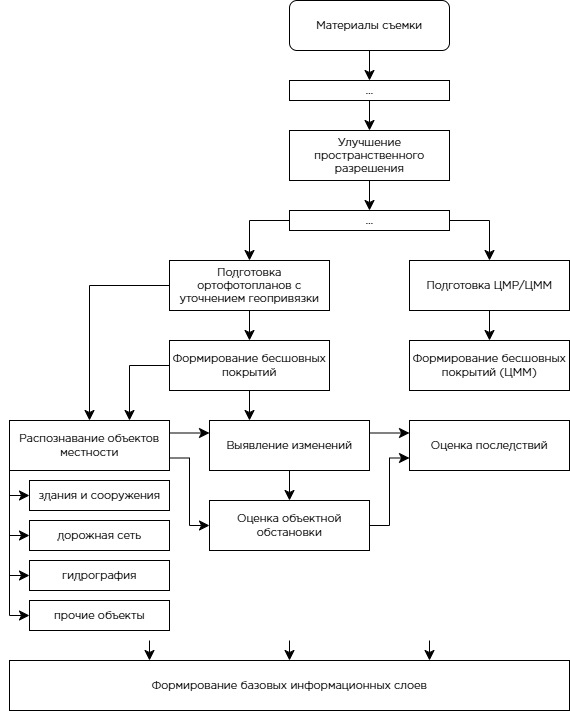

# Направления работ по потенциальным заказчикам

## 1. Оборона и безопасность

*(Минобороны России; предприятия ОПК)*

**Основные:**

- выявление объектов;
- выявление объектовых комплексов;
- выявление изменений;
- актуализация объектовой обстановки.

**Вспомогательные:**

- локальные ортофотопланы;
- векторные слои объектов местности;
- фрагменты опорной картографической основы.

## 2. Земельно-имущественный, кадастровый и картографо-геопространственный блок

*(Росреестр; Роскадастр)*

**Основные:**

- выделение контуров зданий и сооружений;
- выявление изменений застройки;
- выявление изменений землепользования;
- обновление объектов местности.

**Вспомогательные:**
- бесшовные покрытия;
- базовые информационные слои;
- материалы верификации кадастровых сведений.

## 3. Гражданская защита, мониторинг территорий

*(МЧС России; правительства субъектов РФ; органы власти)*

**Основные:**

- выявление изменений в зоне ЧС;
- оценка последствий происшествий и разрушений;
- контроль состояния населённых пунктов и инфраструктуры;
- выявление проблемных участков территорий.

**Вспомогательные:**

- оперативные ортофотопланы;
- ситуационные тематические слои;
- материалы «до/после»;
- подложки для визуализации обстановки.

# Схема нейросетевой обработки материалов съёмки КА ТРИТОН

# Обзор алгоритмов и наборов данных для реализации работ

# Каталог направлений, наборов данных и нейросетевых решений  
*по аналогии с* [satellite-image-deep-learning/techniques](https://github.com/satellite-image-deep-learning/techniques)

Ниже приведена **структура** с акцентом на **устоявшиеся и современные решения 2020–2026 гг.** и с явным разделением на:

- **наборы данных**;
- **алгоритмы и решения**:
  - **[веса]** — имеются публично доступные предобученные веса / контрольные точки;
  - **[код/обучение]** — имеется код и воспроизводимый процесс обучения, однако публичные веса либо отсутствуют, либо опубликованы неявно.

В подборку включены только те позиции, которые выглядят практически полезными для оптических данных и задач на снимках **сверхвысокого пространственного разрешения (VHR)**. Для разделов **уточнения геопривязки / подготовки ЦМР / формирования бесшовных покрытий** число сквозных (end-to-end) публичных моделей с готовыми весами заметно меньше, чем для задач **выявления объектов, сегментации и выявления изменений**.

---
## 0.1. Улучшение пространственного разрешения (суперразрешение)

**Описание направления.**  
Данное направление охватывает задачи повышения пространственного разрешения оптических материалов съёмки за счёт восстановления более детализированного изображения по одному или нескольким исходным изображениям меньшего разрешения. В открытом контуре ДЗЗ наиболее проработанные и воспроизводимые решения этого класса в 2020–2026 гг. в основном ориентированы на данные Sentinel-2 и близкие к ним сценарии межсенсорного повышения разрешения.

### Наборы данных
- **PROBA-V Super Resolution / PROBA-V-REF** — классический эталонный набор данных для многокадрового суперразрешения; конкурс ESA строился на сериях изображений для 78 участков земной поверхности, а вариант PROBA-V-REF дополнительно фиксирует опорное изображение в серии и делает постановку задачи более прикладной для reference-aware super-resolution.  
  <https://kelvins.esa.int/proba-v-super-resolution/>
- **SEN2NAIP / S2-NAIP** — один из наиболее значимых современных наборов данных для 4× повышения разрешения Sentinel-2 по схеме межсенсорного сопоставления с NAIP; в статье описаны 2 851 кросс-сенсорная пара и 17 657 синтетических регионов интереса, всего 20 508 ROI. Репозиторий AllenAI также публикует структуру S2-NAIP и указывает, что данные состоят из согласованных изображений Sentinel-2 и NAIP по территории континентальной части США.  
  <https://huggingface.co/datasets/allenai/s2-naip>
- **OpenSR-test** — современный набор эталонных данных для проверки качества суперразрешения на реальных данных Sentinel-2; пакет включает пять поднаборов: NAIP, SPOT, Venµs, Spain Crops и Spain Urban, специально подготовленных для минимизации пространственного и спектрального рассогласования.  
  <https://github.com/ESAOpenSR/opensr-test>

### Алгоритмы и решения
- **SEN2SR / SEN2SRLite** — современное специализированное решение для повышения пространственного разрешения Sentinel-2 до 2,5 м; модельная карточка Hugging Face указывает наличие двух готовых вариантов — облегчённого `SEN2SRLite` и более точного `SEN2SR`, а статья 2026 года подтверждает доступность кода, наборов данных и моделей в воспроизводимом виде. **[веса]**  
  <https://huggingface.co/tacofoundation/SEN2SR>
- **LDSR-S2 / OpenSR Latent Diffusion** — официальная реализация латентной диффузионной модели для суперразрешения RGB-NIR каналов Sentinel-2; репозиторий OpenSR прямо указывает, что содержит и код, и веса модели. **[веса]**  
  <https://github.com/ESAOpenSR/OpenSR>
- **Satlas Super-Resolution** — прикладной набор моделей для суперразрешения Sentinel-2 по данным S2-NAIP; репозиторий публикует веса для ESRGAN в нескольких конфигурациях, а также для SRCNN и HighResNet, и отдельно описывает структуру используемого набора данных. **[веса]**  
  <https://github.com/allenai/satlas-super-resolution>
- **Better Data for Satellite Super Resolution** — воспроизводимый конвейер подготовки улучшенного набора данных и экспериментов поверх S2-NAIP; репозиторий описывает полный цикл предфильтрации, формирования набора данных и расширения ESRGAN на NIR-канал, однако не заявляет отдельный пакет готовых весов как основной результат. **[код/обучение]**  
  <https://github.com/allenai/satlas-super-resolution>

**Вывод по направлению.**  
Для практического применения в открытом программном контуре наиболее зрелыми решениями с готовыми весами в настоящее время выглядят **SEN2SR / SEN2SRLite**, **LDSR-S2 (OpenSR)** и **Satlas Super-Resolution**. В качестве базовых наборов данных для разработки и проверки целесообразно в первую очередь рассматривать **SEN2NAIP / S2-NAIP**, **OpenSR-test** и **PROBA-V / PROBA-V-REF**.

---

## 0.2. Паншарпенинг

**Описание направления.**  
Паншарпенинг представляет собой задачу объединения мультиспектрального изображения более низкого пространственного разрешения с панхроматическим изображением более высокого пространственного разрешения для получения мультиспектрального изображения высокого разрешения. Это одно из наиболее зрелых и практически востребованных направлений в обработке данных ДЗЗ, особенно для систем классов WorldView, QuickBird, GaoFen и аналогичных им.

### Наборы данных
- **PanCollection** — один из основных открытых эталонных наборов данных для паншарпенинга; репозиторий указывает наличие обучающих и тестовых выборок для WorldView-3, QuickBird, GaoFen-2 и WorldView-2, а также рекомендует использовать этот набор совместно с DLPan-Toolbox для корректного обучения и сопоставимого тестирования.  
  <https://github.com/liangjiandeng/PanCollection>
- **PanBench** — крупный многосценовый набор данных и эталон 2024 года; официальный репозиторий CMFNet публикует структуру датасета по нескольким спутниковым системам, включая GF1, GF2, GF6, IKONOS, Landsat-7, Landsat-8, QuickBird, WorldView-2, WorldView-3 и WorldView-4.  
  <https://github.com/XavierJiezou/Pansharpening>
- **Спутниковые поднаборы WorldView-2 / WorldView-3 / QuickBird / GaoFen-2** — в открытой практике часто используются как самостоятельные испытательные выборки в рамках PanCollection и связанных с ним инструментальных средств; это остаётся наиболее воспроизводимой базой для сравнения современных методов паншарпенинга.  
  <https://github.com/liangjiandeng/PanCollection>

### Алгоритмы и решения
- **CMFNet / Deep Learning for Pansharpening in Remote Sensing** — официальный репозиторий 2024 года, который помимо собственной модели CMFNet содержит единый каталог поддерживаемых методов (`PNN`, `PanNet`, `MSDCNN`, `TFNet`, `FusionNet`, `GPPNN`, `SRPPNN`, `PGCU`, `CMFNet`) и прямо указывает на наличие предобученных моделей в `logs/train/runs`. **[веса]**  
  <https://github.com/XavierJiezou/Pansharpening>
- **Pan-Mamba** — современное решение 2024 года на основе state space model; репозиторий прямо указывает, что раздел по паншарпенингу содержит предобученные контрольные точки, код для вывода и код для обучения. **[веса]**  
  <https://github.com/alexhe101/Pan-Mamba>
- **SDPNet** — решение 2020 года для паншарпенинга с улучшенным представлением информации; официальный репозиторий указывает, что для проверки работы с предобученной моделью достаточно запустить `test.py`, а также содержит сохранённые каталоги моделей. **[веса]**  
  <https://github.com/hanna-xu/SDPNet-for-pansharpening>
- **DLPan-Toolbox** — воспроизводимый инструментальный пакет для обучения и сравнения методов глубокого обучения в задачах паншарпенинга; содержит PyTorch-код для ряда методов и MATLAB-пакет унифицированной оценки, однако как основной результат позиционируется именно кодовая база и среда сравнения, а не единый пакет готовых весов. **[код/обучение]**  
  <https://github.com/liangjiandeng/DLPan-Toolbox>

**Вывод по направлению.**  
В качестве базовой открытой связки для практической работы по паншарпенингу наиболее целесообразно рассматривать **PanCollection + DLPan-Toolbox** для воспроизводимого сравнения методов, а в качестве решений с готовыми весами — **CMFNet / model zoo**, **Pan-Mamba** и **SDPNet**. Для более современных экспериментов и расширения номенклатуры спутниковых систем особый интерес представляет **PanBench**.

# 1. Уточнение геопривязки

**Описание направления.**  
Задачи уточнения геопривязки включают поиск устойчивых соответствий между изображениями, оценку сдвигов и деформаций, локальное совмещение и подготовку опорных точек для последующего ортотрансформирования.

## Наборы данных
- **OSdataset** — высокодетализированный набор данных для регистрации оптических и радиолокационных изображений (optical–SAR registration); включает 20 пар сцен из различных городов мира.  
  <https://github.com/xym2009/OSdataset>
- **3MOS** — крупный современный эталонный набор данных для сопоставления оптических и радиолокационных изображений: из разных источников, разных разрешений и различных сцен.  
  <https://github.com/3M-OS/3MOS>
- **remote-sensing-images-registration-dataset** — наборы данных для регистрации изображений с разрешением 0,23 м, 3,75 м и 30 м (?нерабочий).  
  <https://github.com/liliangzhi110/remote-sensing-images-registration-dataset>
- **DeepAerialMatching datasets** — публичные `training_data` (~18 тыс. пар) и `evaluation_data` (500 пар), опубликованные на Hugging Face вместе с моделью.  
  <https://github.com/jaehyunnn/DeepAerialMatching_pytorch>

## Алгоритмы и решения
- **DeepAerialMatching** — специализированное решение для сопоставления аэрофотоснимков; опубликованы готовые контрольные точки для нескольких базовых архитектур, включая ViT-L/16. **[веса]**  
  <https://github.com/jaehyunnn/DeepAerialMatching_pytorch>
- **LoFTR** — решение для сопоставления без предварительного выделения ключевых точек (detector-free matcher); в официальном репозитории опубликованы 4 предобученные модели (`indoor/outdoor`, `ds/ot`). **[веса]**  
  <https://github.com/zju3dv/LoFTR>
- **LightGlue** — быстрое решение для сопоставления изображений; официально опубликованы предобученные веса для связок с `SuperPoint`, `DISK`, `ALIKED`, `SIFT`. **[веса]**  
  <https://github.com/cvg/lightglue>
- **MINIMA / RISG-image-matching и подобные работы по межмодальному сопоставлению** — полезны как современные исследовательские направления для задач optical–SAR, однако с публичными весами ситуация менее устойчивая. **[код/обучение]**  
  <https://github.com/lan-cz/RISG-image-matching>

**Практический вывод.**  
Для промышленной цепочки уточнения геопривязки наиболее реалистичным выглядит стек **LoFTR / LightGlue / DeepAerialMatching** в сочетании с геодезической постобработкой.

---

# 2. Подготовка ЦМР / ЦММ

**Описание направления.**  
Задачи подготовки **цифровой модели рельефа (ЦМР)** и **цифровой модели местности (ЦММ)** включают стереоскопическую и многовидовую реконструкцию, уточнение исходной цифровой модели поверхности, разделение рельефа и объектов местности, а также повышение качества высотной модели по стереопарам и опорным данным.

## Наборы данных
- **IARPA Multi-View Stereo 3D Mapping** — один из ключевых публичных эталонных наборов данных, доступен через SpaceNet.  
  <https://spacenet.ai/datasets/>
- **CORE3D** — открытый эталонный набор по трёхмерной реконструкции, также представлен в разделе SpaceNet datasets.  
  <https://spacenet.ai/datasets/>
- **ResDepth demo data (Zurich)** — пример открытого демонстрационного набора: исходная цифровая модель поверхности, эталонная цифровая модель поверхности, маска зданий и набор ортоизображений / стереопар.  
  <https://github.com/prs-eth/ResDepth>
- **DeepDEM workflow data** — стереоизображения WorldView-1 и лидарные данные USGS 3DEP по району Mt. Baker как опорный сценарий обучения и валидации.  
  <https://github.com/uw-cryo/DeepDEM>
- **DFC2019 / WorldView-3 crops для Sat-NeRF** — открытые данные для многовидовой спутниковой фотограмметрии.  
  <https://github.com/centreborelli/satnerf>

## Алгоритмы и решения
- **ResDepth** — специализированное решение для уточнения спутниковых цифровых моделей поверхности; официально доступны предобученные контрольные точки и демонстрационные модели (`ResDepth-stereo`, `ResDepth-stereo_generalized`). **[веса]**  
  <https://github.com/prs-eth/ResDepth>
- **RAFT-Stereo** — сильная базовая архитектура для стереозрения; официально опубликованы предобученные модели через `download_models.sh` и Google Drive. Для данных ДЗЗ, как правило, требует адаптации / дообучения. **[веса]**  
  <https://github.com/princeton-vl/RAFT-Stereo>
- **Sat-NeRF** — нейросетевая модель полей излучения (neural radiance field) для многовидовой спутниковой фотограмметрии; в официальном репозитории имеются данные для обучения / тестирования и некоторые предобученные модели. **[веса]**  
  <https://github.com/centreborelli/satnerf>
- **DeepDEM** — современный конвейер уточнения цифровой модели рельефа / местности; код открыт, однако авторы отдельно отмечают, что обученные веса будут опубликованы после окончательной публикации статьи. **[код/обучение]**  
  <https://github.com/uw-cryo/DeepDEM>
- **Deep3D_Aerial / решения класса AdaMVS** — полезны как основа для многовидовой реконструкции, но в основном ориентированы на воспроизводимое обучение, а не на устойчиво доступные публичные веса. **[код/обучение]**  
  <https://github.com/gpcv-liujin/Deep3D_Aerial>

**Практический вывод.**  
Для оптических данных сверхвысокого разрешения реальный стек обычно носит гибридный характер: **стереоскопическая / многовидовая реконструкция + уточнение результата**. Из открыто доступных решений с весами наиболее прикладными выглядят **ResDepth**, **RAFT-Stereo** и **Sat-NeRF**.

---

# 3. Формирование бесшовных покрытий

**Описание направления.**  
Сквозное «нейросетевое формирование бесшовного покрытия» пока редко встречается как зрелый открытый программный продукт. На практике это, как правило, **гибридный конвейер обработки**: уточнение совмещения + радиометрическое выравнивание + удаление облаков и теней + подбор линии сшивки и сглаживание.

## Наборы данных
- **Sen2_MTC_Old / Sen2_MTC_New** — наборы данных для удаления облачности / восстановления изображения, используемые в DiffCR.  
  <https://github.com/XavierJiezou/DiffCR>
- **SEN12MS-CR** — крупный эталонный набор данных для удаления облачности; в ACA-CRNet указано около 110 тыс. образцов из 169 регионов.  
  <https://github.com/XavierJiezou/DiffCR>
- **RICE / RICE1 / RICE2** — популярные наборы данных для удаления облачности на оптических изображениях, непосредственно поддерживаются в ACA-CRNet.  
  <https://github.com/huangwenwenlili/ACA-CRNet>
- **SpaceNet overlap scenes / tiled VHR imagery** — полезны как исходная база для задач сшивки, а также для рабочих процессов с учётом дорожной сети и застройки.  
  <https://registry.opendata.aws/spacenet/>

## Алгоритмы и решения
- **DiffCR** — современное решение на основе диффузионной модели для удаления облачности; имеются официальные веса для `Sen2_MTC_Old`, `Sen2_MTC_New`, `SEN12MS-CR`. **[веса]**  
  <https://github.com/XavierJiezou/DiffCR>
- **ACA-CRNet** — решение для удаления облачности; официально опубликованы предобученные модели для `RICE1`, `RICE2`, `SEN12MS-CR`. **[веса]**  
  <https://github.com/huangwenwenlili/ACA-CRNet>
- **LoFTR / LightGlue** — полезны как нейросетевой этап сопоставления опорных точек перед сшивкой и радиометрическим выравниванием. **[веса]**  
  <https://github.com/zju3dv/LoFTR>

**Практический вывод.**  
Если ориентироваться на промышленное применение, раздел «формирование бесшовных покрытий» корректнее рассматривать не как одну модель, а как **составной конвейер**, в котором нейросети закрывают отдельные подзадачи: **сопоставление**, **удаление облачности**, а иногда и **семантически осмысленный выбор линии сшивки**. Из готовых публичных моделей наиболее зрелыми здесь выглядят **DiffCR** и **ACA-CRNet**, однако это именно решения для очистки / восстановления, а не полноценные средства построения ортомозаики. !! **Требуется разделить на поднаправления**.

---

# 4. Общее распознавание объектов местности

**Описание направления.**  
Сюда относятся задачи **выявления объектов (detection)**, **экземплярной сегментации (instance segmentation)**, **семантической сегментации (semantic segmentation)** и **выявления ориентированных объектов (rotated detection)** на оптических данных сверхвысокого разрешения. Для диапазона 0,25–0,3 м это один из наиболее зрелых классов задач.

## Общие наборы данных
- **xView** — снимки WorldView-3, разрешение 0,3 м, более 1 млн объектов, 60 классов.  
  <https://github.com/ultralytics/ultralytics/blob/main/docs/en/datasets/detect/xview.md>
- **DOTA / DOTA-v2** — базовый эталонный набор данных для выявления ориентированных объектов; в DOTA-v2 указаны 1,7 млн ориентированных ограничивающих рамок и 18 категорий.  
  <https://docs.ultralytics.com/datasets/obb/dota-v2/>
- **iSAID** — крупный эталонный набор данных для экземплярной сегментации на аэроизображениях: 655 451 экземпляр, 15 категорий, 2 806 изображений.  
  <https://captain-whu.github.io/iSAID/>
- **FAIR1M / FAIR1M-2.0** — крупный эталонный набор данных для детального выявления ориентированных объектов на снимках высокого разрешения.  
  <https://github.com/AICyberTeam/2020Gaofen>
- **RSOD** — компактный классический набор данных для выявления объектов на аэроизображениях.  
  <https://github.com/rsia-liesmars-whu/rsod-dataset->

## Общие алгоритмы и решения
- **MMRotate** — фактический стандарт среди инструментальных средств для выявления ориентированных объектов; содержит каталог моделей и предобученные решения. **[веса]**  
  <https://github.com/open-mmlab/mmrotate>
- **Ultralytics YOLO OBB** — готовые модели для ориентированных ограничивающих рамок, предобученные на DOTAv1 и загружаемые автоматически. **[веса]**  
  <https://github.com/ultralytics/ultralytics/blob/main/docs/en/tasks/obb.md>
- **SatlasPretrain** — фундаментальные контрольные точки для задач дистанционного зондирования Земли; официально опубликованы идентификаторы моделей и прямые ссылки на Hugging Face. **[веса]**  
  <https://github.com/allenai/satlaspretrain_models>
- **Galileo** — предобученные модели для дистанционного зондирования; веса доступны на GitHub и Hugging Face. **[веса]**  
  <https://github.com/nasaharvest/galileo>
- **SkySense / SkySense++** — мультимодальная фундаментальная модель для дистанционного зондирования; авторы указывают доступность предобученных весов. **[веса]**  
  <https://github.com/Jack-bo1220/SkySense>
- **GeoSeg / UNetFormer / DC-Swin / семейство PyramidMamba** — набор инструментов для сегментации с предобученными весами базовых архитектур и ссылками на веса моделей. **[веса]**  
  <https://github.com/WangLibo1995/GeoSeg>

---

## 4.1. Здания и сооружения

**Описание направления.**  
Выделение контуров, очертаний и полигонов зданий; одно из наиболее зрелых направлений для данных сверхвысокого разрешения.

### Наборы данных
- **WHU Building Dataset** — популярный эталонный набор данных для выделения зданий; для спутниковой части часто указывается разрешение 0,3 м и 8 188 изображений размером 512×512.  
  <https://pmc.ncbi.nlm.nih.gov/articles/PMC11157594/>
- **Inria Aerial Image Labeling** — классический эталонный набор данных для сегментации зданий, около 810 км², разрешение 0,3 м.  
  <https://github.com/a-milosavljevic/inria-aerial-image-labeling>
- **SpaceNet Building datasets** — официальный открытый источник для задач выделения контуров зданий.  
  <https://registry.opendata.aws/spacenet/>
- **WHU / WHU-Mix** — непосредственно поддерживаются в P2PFormer как наборы данных для выделения полигонов зданий.  
  <https://github.com/zhang-tao-whu/P2PFormer>

### Алгоритмы и решения
- **P2PFormer** — решение для выделения полигональных контуров зданий; имеется каталог моделей и предобученные веса на Hugging Face. **[веса]**  
  <https://github.com/zhang-tao-whu/P2PFormer>
- **GeoSeg / семейство UNetFormer** — хороший практический базовый вариант для сегментации зданий; имеются предобученные базовые архитектуры и ссылки на веса моделей. **[веса]**  
  <https://github.com/WangLibo1995/GeoSeg>
- **SatlasPretrain / Galileo / SkySense** — фундаментальные базовые архитектуры для дальнейшего дообучения под задачи выделения зданий. **[веса]**  
  <https://github.com/allenai/satlaspretrain_models>
- **STT, RSBuilding, DirectSAM-RS** — современные направления по выделению зданий и контуров, однако в открытом виде чаще ориентированы на обучение / адаптацию, а не на готовую контрольную точку для непосредственного применения на конкретном эталонном наборе. **[код/обучение]**  
  <https://github.com/KyanChen/STT>

---

## 4.2. Дорожная сеть

**Описание направления.**  
Извлечение маски дорог, осевых линий и топологии дорожного графа. Для промышленного применения важны не только пиксельные метрики, но и связность итогового графа.

### Наборы данных
- **Massachusetts Roads Dataset** — классический эталонный набор для сегментации дорог; 1 171 аэроизображение размером 1500×1500.  
  <https://github.com/parth1620/Road_seg_dataset>
- **DeepGlobe Road Extraction** — один из основных спутниковых эталонных наборов для выделения дорог.  
  <https://github.com/zlckanata/DeepGlobe-Road-Extraction-Challenge>
- **SpaceNet roads / SpaceNet 3 / 5 / 8** — ключевая линейка эталонных наборов для выделения дорог и анализа дорожной сети после событий.  
  <https://registry.opendata.aws/spacenet/>

### Алгоритмы и решения
- **sam_road** — современное решение для извлечения дорожного графа; имеются официальные контрольные точки на Hugging Face, возможность выполнения вывода по собственным контрольным точкам и использование контрольной точки SAM ViT-B. **[веса]**  
  <https://github.com/htcr/sam_road>
- **GeoSeg / семейство UNetFormer** — пригодны как базовый вариант для сегментации дорог, особенно если требуется многоклассовая сегментация объектов местности. **[веса]**  
  <https://github.com/WangLibo1995/GeoSeg>
- **D-LinkNet** — исторически сильный базовый алгоритм для выделения дорог на DeepGlobe, однако в открытом виде акцент сделан на коде и обучении, а не на устойчиво доступном наборе готовых весов. **[код/обучение]**  
  <https://github.com/zlckanata/DeepGlobe-Road-Extraction-Challenge>
- **SpaceNet8 baselines** — хорошие опорные конвейеры для дорог, затоплений и застройки, однако это скорее воспроизводимые базовые решения, чем пакет готовых весов. **[код/обучение]**  
  <https://github.com/SpaceNetChallenge/SpaceNet8>

---

## 4.3. Гидрография

**Описание направления.**  
Выделение водных объектов, береговой линии, затоплений, временных водных поверхностей и водных масок.

### Наборы данных
- **LoveDA** — набор данных для сегментации земного покрова, поддерживается GeoSeg и полезен как источник класса «вода».  
  <https://github.com/WangLibo1995/GeoSeg>
- **OpenEarthMap** — открытый эталонный набор данных для сегментации, поддерживается GeoSeg и подходит для классов «вода» / «земной покров».  
  <https://github.com/WangLibo1995/GeoSeg>
- **FloodNet** — набор данных для анализа последствий наводнений; включает затопленные / незатопленные дороги и здания, а также класс «вода».  
  <https://github.com/BinaLab/FloodNet-Supervised_v1.0>
- **SEN12MS-CR** — хотя это эталонный набор для удаления облачности, его нередко используют как вспомогательный источник для предварительной обработки задач, связанных с водой, в рабочих процессах Sentinel.  
  <https://github.com/XavierJiezou/DiffCR>

### Алгоритмы и решения
- **OmniWaterMask** — готовая библиотека для сегментации водных объектов на спутниковых и аэрофотоснимках; ориентирована на RGB+NIR и диапазон разрешений 0,2–50 м, заявлена работа с Maxar, NAIP, PlanetScope, Landsat, Sentinel-2. **[готовое решение для вывода]**  
  <https://github.com/DPIRD-DMA/OmniWaterMask>
- **GeoSeg / UNetFormer / DC-Swin** — практичная основа для сегментации воды и классов земного покрова с предобученными весами базовых архитектур и весами моделей. **[веса]**  
  <https://github.com/WangLibo1995/GeoSeg>
- **SatlasPretrain / Galileo / SkySense** — фундаментальные веса для последующего дообучения под задачи выделения гидрографических объектов / воды. **[веса]**  
  <https://github.com/allenai/satlaspretrain_models>
- **MECNet / специализированные работы по сегментации воды** — код имеется, однако с публичными весами ситуация менее устойчивая. **[код/обучение]**  
  <https://github.com/zhilyzhang/MECNet>

---

## 4.4. Самолёты

**Описание направления.**  
Как правило, это выявление ориентированных объектов малых размеров с возможностью детального различения подклассов.

### Наборы данных
- **DOTA / DOTA-v2** — один из основных эталонных наборов данных для выявления самолётов и аэродромной техники с учётом ориентации объекта.  
  <https://docs.ultralytics.com/datasets/obb/dota-v2/>
- **xView** — содержит класс aircraft и множество других военных и инфраструктурных объектов при разрешении 0,3 м.  
  <https://github.com/ultralytics/ultralytics/blob/main/docs/en/datasets/detect/xview.md>
- **FAIR1M / FAIR1M-2.0** — набор данных с детализированными классами, особенно полезный для авиационной техники.  
  <https://github.com/AICyberTeam/2020Gaofen>
- **iSAID / RSOD** — могут использоваться как дополнительные эталонные наборы.  
  <https://captain-whu.github.io/iSAID/>

### Алгоритмы и решения
- **MMRotate** — основное практическое средство для выявления ориентированных самолётов; содержит каталог моделей и предобученные решения. **[веса]**  
  <https://github.com/open-mmlab/mmrotate>
- **YOLO OBB** — быстрый вариант для промышленного применения при выявлении ориентированных самолётов, транспортных средств и судов. **[веса]**  
  <https://github.com/ultralytics/ultralytics/blob/main/docs/en/tasks/obb.md>
- **SatlasPretrain / Galileo / SkySense** — сильные фундаментальные базовые архитектуры для последующего дообучения. **[веса]**  
  <https://github.com/allenai/satlaspretrain_models>

---

## 4.5. Корабли и суда

**Описание направления.**  
Задачи выявления судов, детальной классификации типов судов и выявления ориентированных объектов.

### Наборы данных
- **ShipRSImageNet** — один из наиболее сильных оптических наборов данных по судам: 3 435 изображений, 17 573 экземпляра, 50 классов.  
  <https://github.com/zzndream/ShipRSImageNet>
- **HRSC2016-MS** — обновлённая многомасштабная версия набора данных HRSC2016 для выявления судов.  
  <https://github.com/wmchen/HRSC2016-MS>
- **DOTA / xView** — полезны как многоклассовые наборы данных по ориентированным объектам, включая суда.  
  <https://docs.ultralytics.com/datasets/obb/dota-v2/>
- **LEVIR-Ship** — специализированный набор данных по малоразмерным судам.  
  <https://github.com/WindVChen/LEVIR-Ship>

### Алгоритмы и решения
- **MMRotate** — один из наиболее практичных вариантов для выявления ориентированных судов. **[веса]**  
  <https://github.com/open-mmlab/mmrotate>
- **YOLO OBB** — быстрый прикладной вариант для выявления судов; в документации прямо показан пример использования для этой задачи. **[веса]**  
  <https://github.com/ultralytics/ultralytics/blob/main/docs/en/tasks/obb.md>
- **SatlasPretrain / Galileo / SkySense** — фундаментальные веса для дообучения под задачи выявления и классификации судов. **[веса]**  
  <https://github.com/allenai/satlaspretrain_models>
- **KeyShip и аналогичные специализированные детекторы судов** — представляют интерес, однако по публичным весам ситуация менее устойчива, чем у MMRotate / YOLO OBB. **[код/обучение]**  
  <https://github.com/SlytherinGe/KeyShip>

---

# 5. Выявление изменений

**Описание направления.**  
Классическая задача двухвременного и многовременного выявления изменений: бинарные и семантические изменения, чаще всего по зданиям, застройке, землепользованию и инфраструктуре.

## Наборы данных
- **LEVIR-CD / LEVIR-CD+** — 637 пар изображений сверхвысокого разрешения 1024×1024, разрешение 0,5 м, временной интервал 5–14 лет; один из основных эталонных наборов по изменениям зданий.  
  <https://github.com/justchenhao/LEVIR>
- **S2Looking** — современный набор данных для выявления изменений, официальный доступ через Google Drive / Baidu.  
  <https://github.com/S2Looking/Dataset>
- **SYSU-CD** — 20 000 пар аэроизображений с разрешением 0,5 м из Гонконга, включает изменения зданий, растительности, дорог и морской инфраструктуры.  
  <https://github.com/liumency/SYSU-CD>
- **WHU-CD / DSIFN / CLCD / SECOND** — часто используемые эталонные наборы, непосредственно поддерживаемые современными репозиториями по выявлению изменений.  
  <https://github.com/DingLei14/SAM-CD>

## Алгоритмы и решения
- **SAM-CD** — решение для выявления изменений на основе SAM; авторы непосредственно публикуют обученные веса. **[веса]**  
  <https://github.com/DingLei14/SAM-CD>
- **HCGMNet-CD** — современное решение для выявления изменений; авторы предоставляют веса HCGMNet для `WHU`, `LEVIR`, `SYSU`, `S2Looking`, `CDD`, `DSIFN`. **[веса]**  
  <https://github.com/ChengxiHAN/HCGMNet-CD>
- **ChangeMamba** — один из сильных современных методов; в репозитории предусмотрена загрузка обученных моделей для вывода, включая сценарии бинарного и семантического выявления изменений. **[веса]**  
  <https://github.com/ChenHongruixuan/ChangeMamba>
- **rschange** — современный набор инструментов, полезный как зонтичный проект для новых методов выявления изменений 2025–2026 гг., однако по весам необходимо смотреть по каждой конкретной модели. **[код/обучение]**  
  <https://github.com/xwmaxwma/rschange>

**Практический вывод.**  
Если требуется прикладной старт без длительных исследований и разработок, в первую очередь имеет смысл рассматривать **SAM-CD**, **HCGMNet-CD** и **ChangeMamba**.

---

# 6. Оценка объектовой обстановки

**Описание направления.**  
Это не один отдельный «чистый» эталонный набор, а **составная прикладная задача**: определить, какие объекты присутствуют на участке, каково их количество, как они расположены, имеются ли группы / комплексы, аномалии, уплотнения, изменения конфигурации и т.д.

## Наборы данных
- **xView** — один из лучших публичных источников для общей инвентаризации объектов по спутниковым данным сверхвысокого разрешения.  
  <https://github.com/ultralytics/ultralytics/blob/main/docs/en/datasets/detect/xview.md>
- **DOTA / FAIR1M / iSAID** — основные эталонные наборы для выявления ориентированных объектов, детального распознавания и экземплярной сегментации.  
  <https://docs.ultralytics.com/datasets/obb/dota-v2/>
- **LEVIR-CD / SECOND / xBD** — необходимы в случае, если в понятие объектовой обстановки включается и временной аспект: «что изменилось».  
  <https://github.com/justchenhao/LEVIR>

## Алгоритмы и решения
- **MMRotate + YOLO OBB** — практическое ядро для выявления и инвентаризации ориентированных объектов. **[веса]**  
  <https://github.com/open-mmlab/mmrotate>
- **SatlasPretrain / Galileo / SkySense** — фундаментальные кодировщики признаков для получения сценовых представлений, поиска сходства, контекстной оценки обстановки и дообучения на прикладных задачах. **[веса]**  
  <https://github.com/allenai/satlaspretrain_models>
- **SAM-CD / ChangeMamba** — применимы в тех случаях, когда объектовая обстановка рассматривается как «состав объектов + изменения между датами». **[веса]**  
  <https://github.com/DingLei14/SAM-CD>

**Практический вывод.**  
Для данного раздела обычно требуется **комбинированный конвейер**:
1. детектор / сегментатор;  
2. временная модель для выявления изменений;  
3. слой правил и аналитики поверх полученных результатов.  

То есть «оценка объектовой обстановки» — это скорее **надстройка над разделами 4 и 5**, чем одна самостоятельная нейросеть.

---

# 7. Оценка последствий, постсобытийный мониторинг

**Описание направления.**  
Постсобытийная оценка разрушений, затоплений, нарушений проходимости, повреждений застройки и инфраструктуры по парам изображений «до / после».

## Наборы данных
- **xBD / xView2** — основной публичный эталонный набор для оценки повреждений; в открытых описаниях указываются 22 068 изображений размером 1024×1024 и более 45 000 км² полигонально размеченных пар изображений до и после события.  
  <https://github.com/michal2409/xView2>
- **FloodNet** — набор данных для анализа последствий наводнений: 2 343 изображения с БВС, классы «затопленные / незатопленные здания / дороги», «вода» и др.  
  <https://github.com/BinaLab/FloodNet-Supervised_v1.0>
- **SpaceNet8** — эталонная задача по дорогам, зданиям и анализу последствий затоплений после событий.  
  <https://github.com/SpaceNetChallenge/SpaceNet8>

## Алгоритмы и решения
- **xView2 first-place solution** — официальный репозиторий победившего решения; имеется релиз с весами. **[веса]**  
  <https://github.com/DIUx-xView/xView2_first_place>
- **xView2-deploy** — прикладная обвязка для выполнения вывода поверх весов победившего решения xView2; непосредственно ссылается на модельные веса из победившего решения. **[веса]**  
  <https://github.com/DIUx-xView/xView2-deploy>
- **ChangeMamba (MambaBDA)** — современное направление, в том числе для оценки повреждений зданий. **[веса]**  
  <https://github.com/ChenHongruixuan/ChangeMamba>
- **SAM-CD / HCGMNet-CD** — подходят для масок воздействия / изменений, если задача формулируется как семантическое или бинарное постсобытийное выявление изменений. **[веса]**  
  <https://github.com/DingLei14/SAM-CD>
- **Microsoft building-damage-assessment toolkit** — сильный прикладной набор инструментов / рабочий процесс, использованный на реальных событиях 2023–2024 гг., однако в README основной упор сделан на дообучение и выполнение вывода, а не на публикацию отдельного пакета готовых весов. **[код/обучение]**  
  <https://github.com/microsoft/building-damage-assessment>